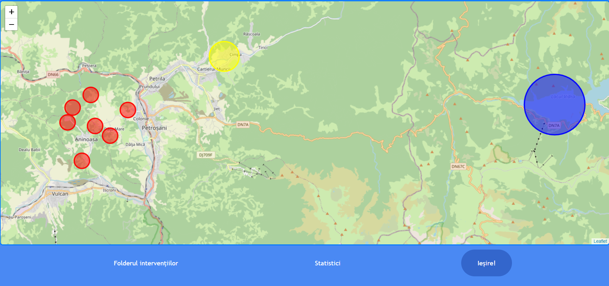
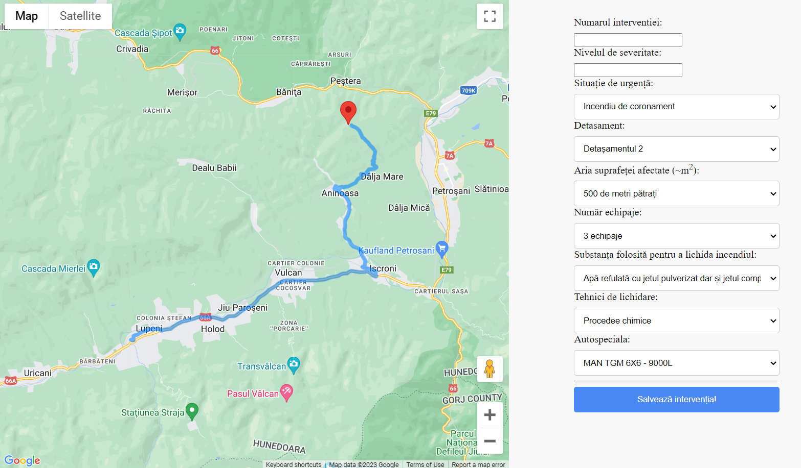
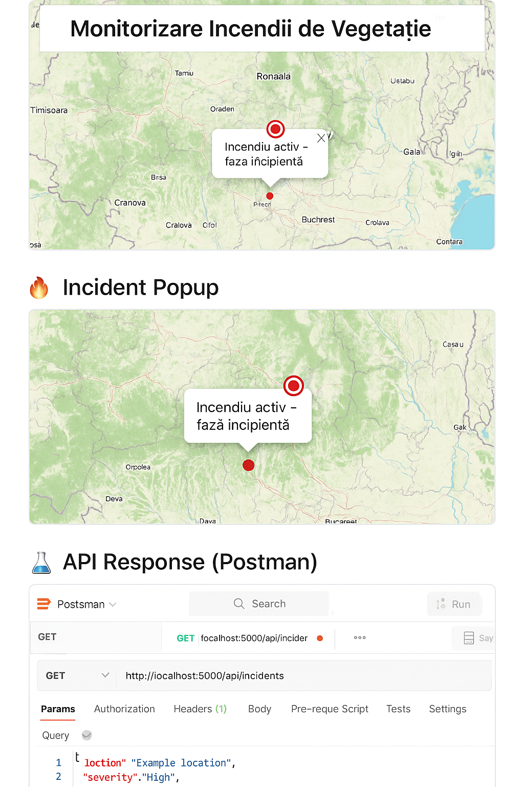

# Fire Emergency Management – Full-Stack Web Application

This repository contains the full web application. The app is designed to help monitor and manage vegetation fire incidents in Romania using open data, interactive maps, and a simple backend.

---

## 🔥 Project Overview

- Real-time fire incident visualization using Leaflet and OpenStreetMap
- Backend API for storing and retrieving vegetation fire reports
- MongoDB database integration for incident management
- Fully documented source code and academic thesis included

---

## 🧰 Tech Stack

### Frontend:
- HTML5
- CSS3
- JavaScript (Vanilla)
- Leaflet.js (interactive map)

### Backend:
- Node.js
- Express.js
- MongoDB
- Mongoose (ODM)

### Other Tools:
- REST API
- dotenv for environment config
- PDFKit (optional extension)
- Git & GitHub for version control

---

## 🗂️ Project Structure

```
fire-emergency-management-concept/
├── frontend/         # Web map UI (HTML, CSS, JS)
├── backend/          # Express.js REST API
│   ├── models/
│   └── routes/
├── demo/             # Screenshots or screen recordings
├── .env.example      # Template for environment variables
├── .gitignore
└── README.md
```

---

## 🚀 Getting Started

### 1. Clone the repository

```bash
git clone https://github.com/flavius-dev/fire-emergency-management-concept.git
cd fire-emergency-management-concept
```

### 2. Install backend dependencies

```bash
cd backend
npm install
```

### 3. Configure environment variables

Rename `.env.example` to `.env` and update:

```env
PORT=5000
MONGO_URI=mongodb://localhost:27017/fire_incidents
JWT_SECRET=your_secret_key
```

### 4. Run the backend server

```bash
npm start
```

### 5. Open the frontend

Navigate to:

```
frontend/index.html
```

Open it in a browser to view the interactive fire incident map.


---

## 🖼 Screenshots


### 🔥 Fire Map View


### 📍 Incident Popup


### 🧪 API Response (Postman)


---

## 👤 Author

**Flavius-Constantin Condoiu**  
Bachelor of Engineering – University of Petroșani, 2023

---

## 🌍 Live Demo

 
🔗 [Demo on GitHub Pages](https://flavius-dev.github.io/fire-emergency-management-concept/)

---

## 📜 License

This project is licensed under the MIT License.
